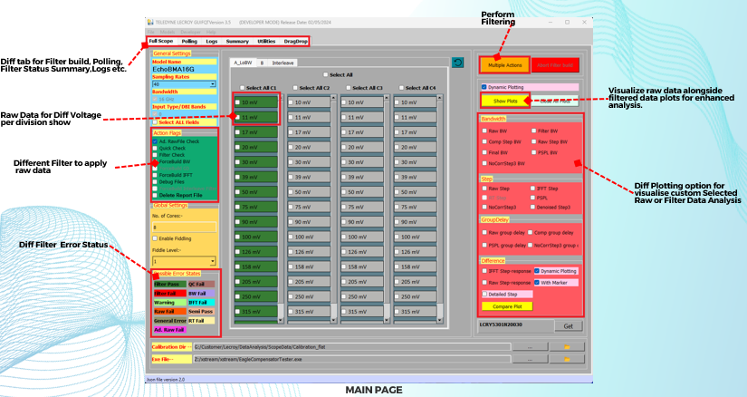

# GUIF - Graphical User Interface for Oscilloscope Data Filtering

## Overview
**GUIF** is a powerful GUI application designed to filter and analyze oscilloscope data efficiently. It provides an interactive interface for applying various filters to raw numerical oscilloscope data, enabling real-time visualization of transformations and enhanced data analysis.

Oscilloscope data is often noisy, requiring advanced filtering algorithms to extract meaningful insights. **GUIF** simplifies this process by providing:
- Intuitive GUI for seamless user interaction
- Support for multiple filters (Bandwidth, Group Delay, IFFT, etc.)
- Static and interactive data visualization (Matplotlib & Plotly)
- Multi-threading & multiprocessing for fast computations
- Log monitoring & HTML report generation for data sharing

## Key Features
- **Intuitive Interface:** User-friendly GUI built with PyQt5
- **Multiple Filtering Options:** Apply filters dynamically to oscilloscope data
- **Enhanced Data Analysis:** Evaluate rise time, overshoot, preshoot, and more
- **Customizable Processing:** Select cores & monitor filter application in real-time
- **Real-time & Interactive Charts:** View changes dynamically with Matplotlib & Plotly
- **Detailed Reporting:** Generate HTML reports summarizing filter performance
- **Concurrency & Performance:** Parallel processing for efficient filtering

## Why GUIF?
- **Diverse Filtering Options:** Essential filters like bandwidth, group delay, and IFFT
- **Comprehensive Data Analysis:** Helps professionals make informed decisions
- **Efficient Visualization:** Instant feedback through graphical plots
- **Affordable Solution:** Advanced functionalities at a cost-effective price point
- **Accessibility:** Designed for professionals across various domains

## Technology Stack
### Frontend
- **Python (PyQt5):** Used for building an interactive and dynamic user interface

### Backend
- **C++:** Implementation of high-performance filter algorithms
- **Python (NumPy, Pandas, Matplotlib, Plotly):** Data processing & visualization

### Concurrency & Performance
- **Multiprocessing & Multi-threading:** Parallelized filter applications for efficiency

### Reporting
- **HTML & CSS:** Structured data representation for easy analysis & sharing

## Features Breakdown
### 1. Polling Feature
- Apply filters to raw data
- Utilize multiprocessing for enhanced performance
- Customizable settings (core allocation, monitoring intervals)

### 2. Multiple Action Feature
- Apply multiple filters to selected raw data
- Optimized multiprocessing for performance
- User-friendly & highly customizable

### 3. Data Analysis
- Evaluate signal characteristics (rise time, overshoot, preshoot)
- Identify data quality using over-limit analysis

### 4. Data Visualization
- Interactive charts & static plots
- Drag-and-drop interface for instant plotting

### 5. Detailed Reporting
- HTML reports summarizing filter results & plots

### 6. Oscilloscope Compatibility
- Supports various oscilloscope models for versatile usage

### 7. Customizable Limits
- Set & adjust limits for in-depth analysis
- View status updates in tabular format

## How to Use GUIF
1. Install dependencies:
   ```bash
   pip install pyqt5 numpy pandas matplotlib plotly
   ```
2. Run the application:
   ```bash
   python gui_application.py
   ```
3. Load raw oscilloscope data
4. Apply filters & visualize transformations
5. Save reports & share with your team

## Screenshots
### 1. Main Screen


### 2. Charts


## Contact
For inquiries or collaborations, reach out via email or open an issue on GitHub.

---
