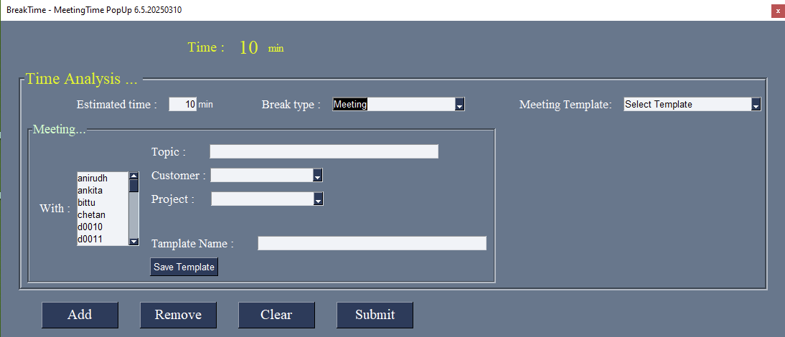
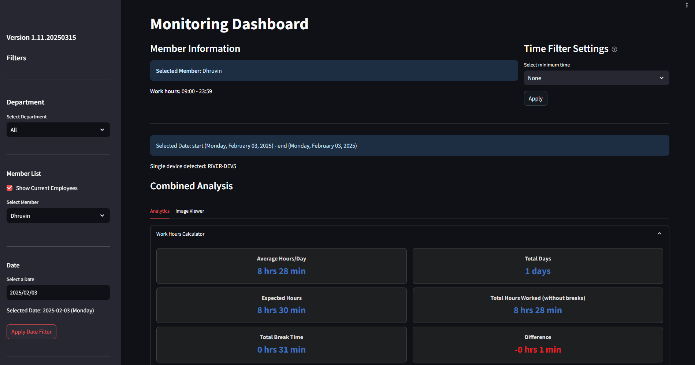

# Monitoring - User Activity Tracking System

## Overview
**Monitoring** is an intelligent user activity tracking system designed to enhance productivity and transparency within an organization. It helps track user engagement on their computers, identify idle time, and collect insights into how time is spent across different activities.

Organizations often struggle with understanding where the majority of time is spent by employees. **Monitoring** solves this problem by providing:
- **Real-time user activity tracking**
- **Automated idle time detection**
- **User prompts for activity justification**
- **Comprehensive dashboard analytics**

By analyzing this data, businesses can **optimize workflows, reduce inefficiencies, and improve operational efficiency**.

## Key Features
- **Automated User Tracking:** Seamlessly monitors computer activity in the background
- **Idle Time Detection:** Detects inactivity and prompts users to justify their time usage
- **Simple & Non-Intrusive:** Uses lightweight Python-based monitoring with minimal system impact
- **User-Friendly Popups:** Prompts users for input after a configured idle time (e.g., 10 minutes)
- **Insightful Dashboards:** Data visualization tools to analyze user activity trends
- **Customizable Tracking Settings:** Adjustable idle time limits & reporting formats

## Why Monitoring?
- **Enhances Workplace Productivity:** Provides clear insights into time usage
- **Identifies Bottlenecks:** Highlights where time is spent inefficiently
- **Improves Transparency:** Ensures accountability for work activities
- **Data-Driven Decision Making:** Helps management make informed improvements
- **Lightweight & Efficient:** Runs in the background without disrupting workflows

## Technology Stack
### Application Development
- **Python (PySimpleGUI):** For interactive user popups & input collection
- **Python (System APIs):** To track keyboard & mouse activity

### Data Collection & Storage
- **Local System (.csv):** To store user activity logs
- **Pandas & NumPy:** For data processing & analytics

### Data Visualization & Reporting
- **Streamlit:** For building interactive dashboards, data representation & trend analysis

## How It Works
1. **Monitoring Starts:** The application runs in the background, tracking user activity
2. **Idle Detection:** If no keyboard or mouse activity is detected for a configurable time (e.g., 10 minutes), a popup appears
3. **User Justification:** The user is prompted to enter what they were doing during this time
4. **Data Logging:** The input is stored along with timestamps & system activity details
5. **Dashboard Insights:** Management can review interactive reports on time usage trends

## Features Breakdown
### 1. Real-Time Tracking
- Monitors keyboard & mouse interactions
- Detects when a user is actively engaged

### 2. Idle Time Alert
- Detects inactivity beyond a set threshold
- Displays an interactive popup for user input

### 3. Customizable Monitoring
- Configurable idle time settings
- Adjustable logging parameters

### 4. Dashboard & Reports
- Generates analytics on user time allocation
- Displays key trends using interactive graphs

### 5. Secure & Lightweight
- Runs with minimal system resources
- Ensures data privacy & encryption

## Screenshots
### 1. IdealTime Popup

### 2. Dashboard

