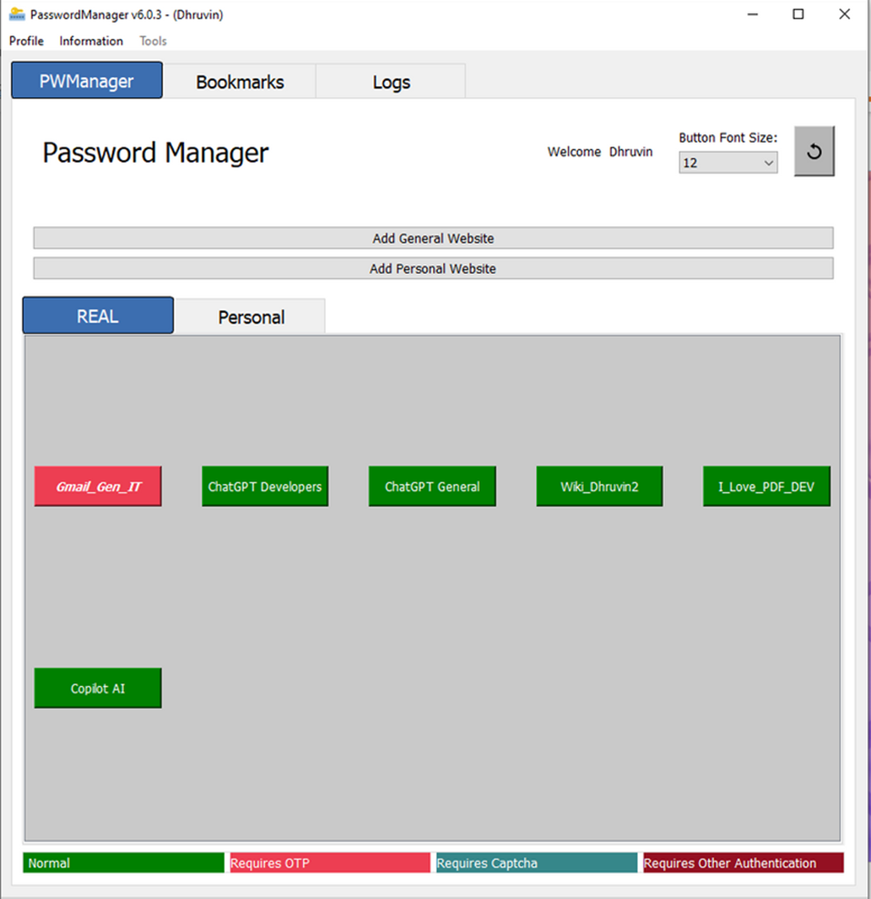

# PasswordManager - Secure Password Management System

## Overview
**PasswordManager** is a robust desktop software designed to **securely store, manage, and share passwords** while ensuring top-tier encryption and automation. It provides an intuitive and hierarchical password management system, allowing organizations and individuals to securely access, store, and share credentials with complete transparency.

Key functionalities include:
- **User authentication & role-based access control**
- **Secure encrypted password storage**
- **Automated website login via Playwright & Selenium**
- **User activity tracking & access logs**
- **Email notifications for sensitive logins**
- **Hierarchical password sharing for team collaboration**

With **PasswordManager**, organizations can **enhance security, streamline access management, and prevent unauthorized credential usage.**

## Key Features
### 1. User Authentication & Hierarchy Management
- Secure login system with user roles (Admin, Manager, Employee, etc.)
- Organize users with varying access levels for streamlined collaboration

### 2. Secure Account Sharing
- Share credentials without exposing passwords
- Assign permissions to users based on hierarchy levels

### 3. Auto Login to Websites
- Automate login with a single click using **Selenium & Playwright**
- Supports a wide range of websites & applications

### 4. Encrypted Password Storage
- AES-256 encryption to safeguard stored credentials

### 5. Easy Password Sharing
- Simplify sharing among authorized users without compromising security

### 6. Button-Based Access
- One-click login to any stored credential, improving efficiency

### 7. User Activity Logs & Monitoring
- Track **who accessed which credentials & when**
- Log user activity for auditing & security compliance

### 8. Email Notifications on Sensitive Logins
- Get **real-time alerts** when credentials for critical accounts are used
- Configure email notifications for selected users

## Why Choose PasswordManager?
- **Eliminates manual password management hassles**
- **Prevents unauthorized access with encryption & logging**
- **Automates website login workflows**
- **Enhances security through user hierarchy & tracking**
- **Improves efficiency with quick access to credentials**

## Technology Stack
- **Frontend:** Python (PyQt5) for desktop GUI
- **Encryption:** AES-256 for secure password management
- **Automation:** Selenium & Playwright for auto-login functionality
- **Logging & Notifications:** Python SMTP for email alerts

## How It Works
1. **User Login:** Secure authentication before accessing stored passwords
2. **Password Storage:** Add credentials & encrypt them in the database
3. **Hierarchy-Based Sharing:** Share access securely without revealing passwords
4. **Auto-Login Feature:** Click-to-login with Playwright/Selenium automation
5. **Activity Logs:** Track login & access history
6. **Email Alerts:** Notify users on sensitive credential usage

## Screenshots

### 1. Main Screen

