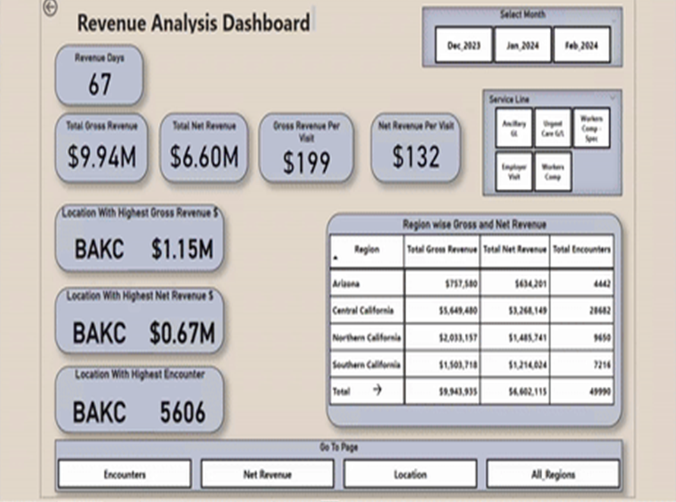
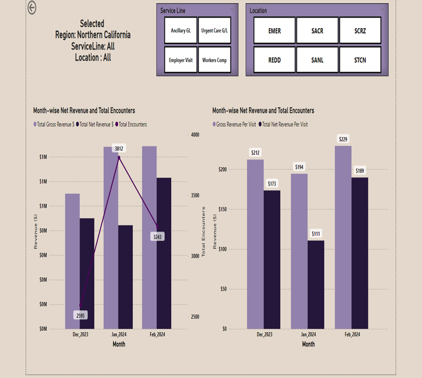
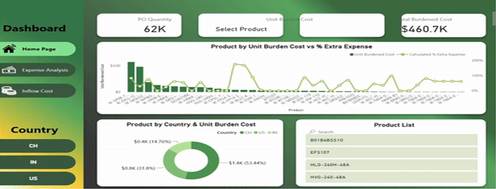

# Power BI Dashboarding - Data Visualization & Business Intelligence

## **Overview**
In today's data-driven world, businesses generate vast amounts of data, making traditional data analysis methods **time-consuming, error-prone, and inefficient**. This necessitates modern tools like **Power BI**, which provides **real-time interactive dashboards** and **business intelligence capabilities** to enhance data-driven decision-making.

## **Challenges in Data Analysis**

🔹 **Volume & Complexity** - Large datasets make traditional analysis difficult.

🔹 **Unstructured Data** - Lack of structured data prevents accurate insights.

🔹 **Decision-Making Delays** - Slow processing leads to inefficiencies.

## **How Power BI Solves These Challenges**

✅ **Interactive Visualizations** - Users can explore data dynamically.

✅ **Real-Time Insights** - Live dashboards provide up-to-date information.

✅ **Automated Data Processing** - Reduces manual efforts and errors.

✅ **Business Intelligence (BI) Capabilities** - Enhances strategic decision-making.

## **Key Functionalities of Power BI Dashboards**
### **1. Real-Time Financial Data**
- Provides **up-to-date financial insights** to improve decision-making.
- Tracks **cash flow, revenue trends, and cost analysis** in real-time.

### **2. Financial Planning & Budgeting**
- Enables businesses to **maximize profitability** by analyzing income & expenses.
- Forecasting models help in **future financial planning**.

### **3. Supply Chain & Inventory Management**
- Enhances **visibility into stock levels, stock-outs, and replenishment cycles**.
- Helps optimize inventory & reduce operational costs.

### **4. Cost Analysis & Performance Tracking**
- Tracks product-wise cost **across multiple regions & categories**.
- Identifies areas where costs can be **optimized & reduced**.

### **5. Industry-Specific Solutions**
#### **📊 Import-Export Business Analysis**
- Custom dashboards to track **duties, tariffs, and regional price variations**.
- Breaks down product costs **based on country-specific import regulations**.

#### **🏥 Healthcare & Clinical Trials**
- Dashboards for **patient management & trial analysis**.
- Data-driven insights for **treatment efficiency & drug testing**.

## **Business Benefits**

🚀 **Enhanced Decision-Making** - Provides deeper insights through **data visualization**.

📊 **Operational Efficiency** - Reduces manual errors & increases data accuracy.

💡 **Scalability** - Adapts to **growing data** volumes effortlessly.

📉 **Cost Reduction** - Helps in **identifying unnecessary expenses & optimizing budgets**.

## **Technology Stack**
- **Data Processing:** Python, SQL, Excel Macros
- **Visualization & BI:** Microsoft Power BI
- **Automation & ETL:** Power Query, DAX (Data Analysis Expressions)

## **Implementation Steps**
1. **Data Collection** - Connect Power BI to **databases, APIs, or Excel files**.
2. **Data Transformation** - Use **Power Query & DAX** for data cleaning.
3. **Dashboard Creation** - Design **interactive reports & visualizations**.
4. **Real-Time Updates** - Implement **automated refresh schedules**.
5. **Data Sharing & Collaboration** - Provide insights across teams.

## **Screenshots & Reports**

### 1. Finance Dashboard

### 2. Import-Export-Manufacturing Dashboard

## **Conclusion**
Power BI empowers organizations with **real-time analytics, interactive reports, and AI-powered insights**. Whether it’s **financial forecasting, supply chain management, or clinical trial monitoring**, Power BI helps businesses turn raw data into **actionable intelligence**.
